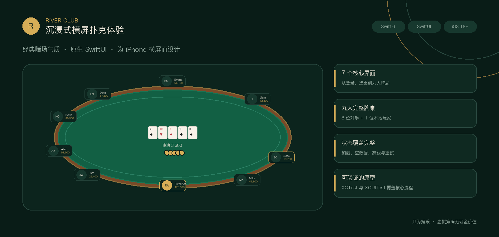
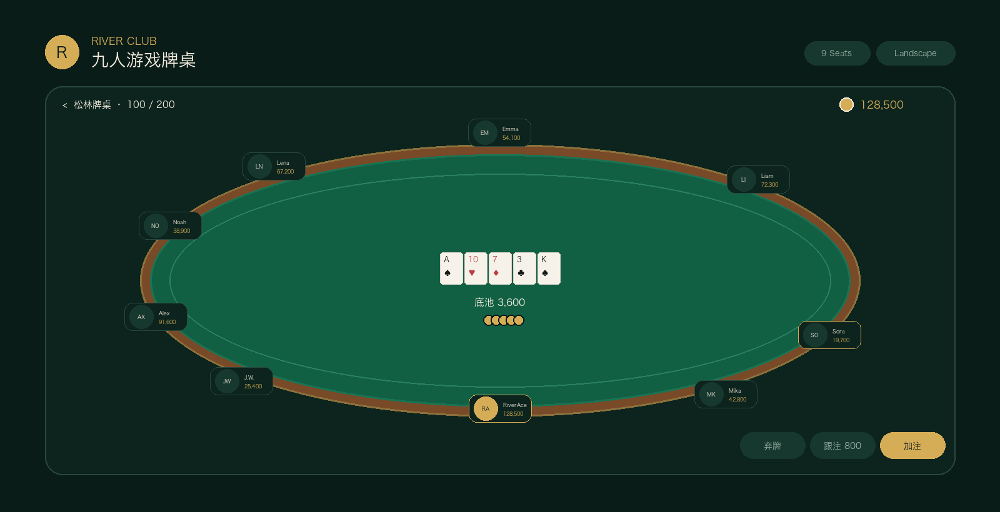
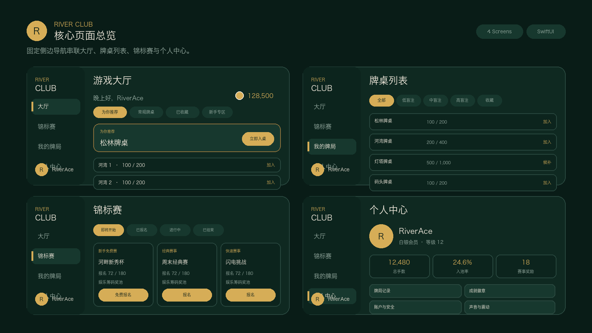

<p align="center">
  
</p>

<h1 align="center">River Club</h1>

<p align="center">
  使用 SwiftUI 与本地规则引擎构建的沉浸式 iPhone 横屏德州扑克原型
</p>

<p align="center">
  
  
  
  
</p>

## 项目简介

River Club 是一个面向 iPhone 横屏体验的本地德州扑克原型。项目以经典赌场氛围为视觉基础，使用深墨绿、胡桃木与古金色构建从登录、选桌、买入、九人牌局到牌局存档的完整体验路径。

当前版本已经接入本地 `PokerCore` 规则引擎、娱乐筹码账本、普通桌机器人与永久牌局存档。大厅展示数据仍由本地 Repository 提供；游戏流程、动作合法性、底池结算和存档则由真实本地牌局状态驱动。

> River Club 仅使用无现金价值的娱乐筹码，不提供真钱充值、提现、兑换或任何变现能力。

## 界面展示

以下图片为依据当前 SwiftUI 实现制作的项目设计展示图，不是模拟器实机截图。

### 九人游戏牌桌

<p align="center">
  
</p>

- 八位对手与一位本地玩家完整可见。
- 公共牌、底池与筹码堆保持清晰的中心层级。
- 弃牌、跟注与加注操作固定在右下角，不侵入系统安全区。
- 本地玩家固定在底部视觉中心，头像保持正圆。

### 核心页面

<p align="center">
  
</p>

固定侧边导航连接游戏大厅、锦标赛、我的牌局与个人中心；进入牌桌后切换为沉浸式全屏体验。

## 核心功能

| 模块 | 已实现内容 |
| --- | --- |
| 登录 | Apple 登录入口、游客快速体验、年龄与隐私提示 |
| 游戏大厅 | 推荐桌、分类切换、盲注选择、快速匹配、热门牌桌 |
| 牌桌列表 | 盲注、桌型、空位与收藏筛选，支持加入或候补 |
| 买入确认 | 买入范围、余额校验、自动补充开关与确认入座 |
| 九人牌桌 | 九个座位、公共牌、底池、聊天入口与下注控制 |
| 本地牌局 | `PokerCore` 负责发牌、动作合法性、下注轮次、底池与结算，支持普通桌可玩闭环 |
| 机器人 | 机器人只依据自身安全观察和公开桌面信息决策，不能读取其他玩家隐藏底牌 |
| 我的牌局 | 已完成牌局永久保存到 Application Support，可查看最终结果、九个座位及所有实际获发的最终底牌 |
| 锦标赛 | 即将开始、已报名、进行中、已结束四种状态 |
| 个人中心 | 等级、总手数、入池率、赛事奖励与设置入口 |
| 异常状态 | 加载骨架、空数据、失败重试、离线缓存提示 |

## 体验流程

```text
登录 / 游客体验
       ↓
    游戏大厅 ─────→ 锦标赛
       ↓
    牌桌列表 ─────→ 候补
       ↓
    买入确认
       ↓
    九人牌桌
```

核心流程由确定性的本地状态驱动，方便独立审查界面和自动化测试，不依赖网络环境。

进行中的牌局只向本地玩家显示自己的底牌，对手底牌保持隐藏。牌局完成并永久保存后，“我的牌局”详情才会展示所有实际获发的最终底牌，包括已经弃牌的玩家。

## 技术实现

- **Swift 6 + SwiftUI**：使用 Apple 原生框架构建全部界面。
- **Observation**：`AppSession` 统一管理登录、导航、余额和入桌状态。
- **本地扑克模块**：`PokerCore`、`PokerSession`、`PokerBot` 与 `PokerCoordinator` 分别负责规则、会话持久化、机器人安全决策和牌桌编排。
- **Repository 抽象**：`PokerRepository` 定义大厅展示数据契约，`MockPokerRepository` 提供可重复的本地目录数据。
- **永久存档**：完成牌局保存在 Application Support；删除存档不会修改娱乐筹码余额或本地永久身份数据。
- **功能化目录**：登录、大厅、牌桌、锦标赛与个人中心按功能拆分。
- **可复用设计系统**：颜色、侧边栏、筹码余额和通用加载状态保持一致。
- **可访问性**：关键触控区域、语义标签、减少动态效果与非纯颜色状态提示均纳入实现。
- **自动化测试**：XCTest 覆盖状态与布局规则，XCUITest 覆盖游客买入到九人桌的核心路径。

## 项目结构

```text
RiverClub/
├── App/                    # 应用入口、根路由与会话状态
├── DesignSystem/           # 主题、侧边导航与余额组件
├── Features/
│   ├── Auth/               # 登录与游客体验
│   ├── Lobby/              # 大厅、牌桌列表与买入确认
│   ├── Table/              # 九人牌桌、座位与下注控制
│   ├── Tournaments/        # 锦标赛列表
│   ├── Profile/            # 个人中心
│   ├── History/            # 已完成牌局列表、筛选、详情与删除
│   └── Shared/             # 加载、空态、离线与错误状态
├── Models/                 # UI 领域模型
└── Services/               # Repository 协议与本地模拟数据

RiverClubTests/             # 单元测试
RiverClubUITests/           # 横屏布局与核心流程 UI 测试
Packages/PokerCore/         # 规则、会话、机器人和协调器 Swift Package
project.yml                 # XcodeGen 项目定义
```

## 本地运行

### 环境要求

- macOS
- Xcode 26（包含 iOS 18 或更高版本 Simulator）
- [XcodeGen](https://github.com/yonaskolb/XcodeGen) 2.43 或更高版本

### 生成并打开项目

```bash
xcodegen generate
open RiverClub.xcodeproj
```

在 Xcode 中选择 `RiverClub` scheme 和可用的 Pro Max 模拟器后运行。应用只支持向左和向右横屏。

## 测试

在完整 Xcode 环境中运行全部单元测试与 UI 测试：

```bash
DEVELOPER_DIR=/Applications/Xcode.app/Contents/Developer \
xcodebuild test \
  -project RiverClub.xcodeproj \
  -scheme RiverClub \
  -destination 'platform=iOS Simulator,name=iPhone 16 Pro Max'
```

测试重点包括：

- 登录、导航、入桌和离桌状态。
- 买入范围、余额不足、快速匹配和候补行为。
- 九个唯一座位与本地玩家底部居中规则。
- 多种安全画布尺寸下的横屏布局。
- 加载、空数据、离线缓存与失败重试状态。
- 核心游客流程和娱乐筹码合规性。
- 真实牌局完成、重启读取、九座位最终底牌、删除与余额不变。
- 普通 `import` 无法访问牌堆、随机种子、检查点和进行中摊牌信息等隐藏边界。

## 当前范围

当前仓库是本地单机工程原型，已实现界面导航、列表筛选、买入校验、九人桌布局、本地普通桌牌局、娱乐筹码结算和完成牌局存档。

暂未包含：

- 实时多人通信与断线同步。
- 生产级 Apple 登录、账户与身份服务。
- 真钱充值、提现、兑换或任何现金价值能力。
- 云端牌局、余额或身份同步。
- 服务端赛事、牌桌和玩家数据。
- App Store 发布配置与生产运维能力。

## 后续方向

1. 接入正式身份与玩家资料服务。
2. 为大厅 Repository 增加网络实现和离线缓存策略。
3. 在保持隐藏信息边界的前提下设计实时多人牌局同步。
4. 增加设计资源、动态效果与更多无障碍验证。
5. 持续运行规则性质测试、单元测试和真实流程 UI 测试。

## 免责声明

River Club 是用于本地玩法、界面设计与工程验证的娱乐型扑克原型。项目中的筹码没有现金价值，不能充值、提现、兑换或转化为任何真实货币或收益；项目不提供真钱扑克服务，也不提供实时多人网络、云同步或生产身份服务。
